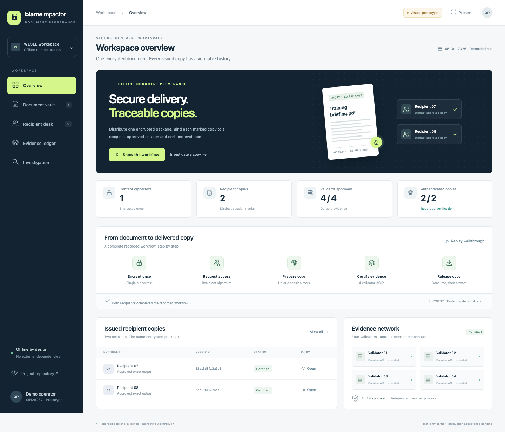

# Blame Impactor — visual prototype

A portable, interactive presentation of the SIH26237 document-provenance system.
Open **index.html** in a modern browser. No build, installation, external fonts,
CDN, API keys or internet connection is required.



Read the self-contained **[problem and solution explanation](explanation.html)**
for the workflow, actual evidence and remaining acceptance limits.

For a local server, run from this folder:

```sh
python3 -m http.server 8080 --bind 127.0.0.1
```

Then open http://127.0.0.1:8080. Stop the server with Ctrl+C.

## A quick presentation

1. Start on **Overview** and click **Show the workflow**.
2. Open **Document vault** to explain one ciphertext and two recipient envelopes.
3. Open **Recipient desk**, replay an approval, and download an actual marked copy.
4. Open **Evidence ledger** and inspect the four recorded session/claim blocks.
5. Open **Investigation**, select either sample and show its actual recorded verdict.
6. Show the metadata-rewrite and mismatched-evidence tests. Drop a downloaded sample
   onto the page to demonstrate a local exact-byte hash comparison.
7. Click **Present** to hide the sidebar for a cleaner presentation view.

## Evidence versus visual controls

The PDFs, certificates/ACK proofs and result data come from the actual tested
Python/native C/Go prototype run `20261005T040807476254Z`. That run used one
ciphertext, two restricted recipient signers, four real Go SmartBFT processes,
native pure-PQ TLS and original durable one-use grants. The native verifier
authenticated both outputs and recovered a session after a PDF metadata rewrite.

This static UI **replays recorded evidence**. Its buttons do not create new
packages, signatures, claims or forensic verdicts. The file drop computes only
an exact SHA-384 comparison locally; it does not validate signatures or detect
transformed marks. The production carrier, trusted consent UI, independent
deployment, protected restartable custody and platform acceptance remain open.
Recipient/session association does not establish which human leaked a copy.

Only public synthetic samples are included. No private key, unlock password,
watermark key, private source mapping or encrypted custody archive is included.

## GitHub

Repository: https://github.com/Sudheer1515B/blameimpactor

This **prototype/** folder is the deliberately scoped visual deliverable. It
also works as a static GitHub Pages site. No private backend custody files or
developer SDKs are needed to view it.

The native Python/C/Go backend is maintained in the development checkout. This
repository snapshot presents its public recorded evidence; installing and
running the native services is a separate implementation/deployment step.
